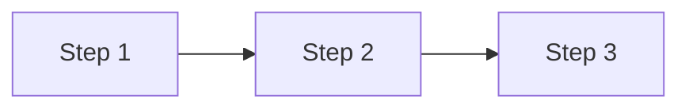
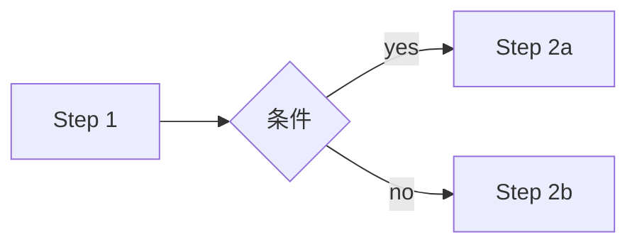
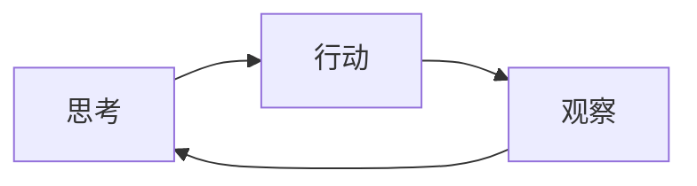

# Agent 工作流示例

> 端到端工作流 — 展示 Agent Skills 与 Prompts 的组合使用

## 📋 索引

| 工作流 | 模式 | 描述 |
|--------|------|------|
| [register-and-query](register-and-query.md) | 顺序 | 注册 → 查询 |
| [batch-then-verify](batch-then-verify.md) | 顺序 | 批量注册 → 逐一验证 |
| [conditional-upgrade](conditional-upgrade.md) | 条件 | 根据 owner 决定是否升级 |
| [chain-cot](chain-cot.md) | CoT | 思考链推理 |
| [react-loop](react-loop.md) | ReAct | 推理 + 行动循环 |

## 🔄 工作流模式

### 1. 顺序工作流

### 2. 条件工作流

### 3. ReAct 循环

## 📂 文件命名

`{pattern}-{description}.md` 例如：
- `register-and-query.md` — 顺序
- `conditional-upgrade.md` — 条件
- `react-loop.md` — ReAct
